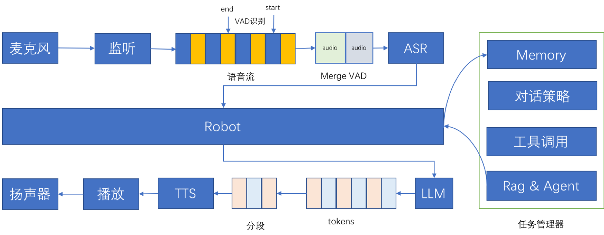

# Bailing

**Bailing** is an open-source voice assistant designed to engage in natural conversations with users via voice. The project combines Automatic Speech Recognition (ASR), Voice Activity Detection (VAD), Large Language Models (LLM), and Text-to-Speech (TTS) technologies. It is a voice-based conversational bot similar to GPT-4o, powered by ASR + LLM + TTS, delivering a high-quality voice interaction experience with an end-to-end latency of 800ms. Bailing aims to achieve GPT-4-like conversation quality without requiring a GPU, making it suitable for various edge devices and low-resource environments.


## Features

- **Efficient Open-Source Models**: Bailing utilizes multiple open-source models, ensuring an efficient and reliable voice conversation experience.
- **No GPU Required**: Through optimization, it can be deployed locally while still delivering GPT-4-like performance.
- **Modular Design**: ASR, VAD, LLM, and TTS modules are independent and can be replaced or upgraded as needed.
- **Memory Support**: It has continuous learning capabilities, remembering user preferences and historical conversations for a personalized interaction experience.
- **Tool Integration**: It flexibly integrates external tools, allowing users to request information or perform actions via voice, enhancing the assistant's practicality.
- **Task Management**: Efficient task management allows the assistant to track progress, set reminders, and provide dynamic updates, ensuring users never miss important tasks.

## Project Overview

Bailing implements the voice interaction functionality through the following technical components:

- **ASR**: Uses [FunASR](https://github.com/modelscope/FunASR) for automatic speech recognition to convert user speech into text.
- **VAD**: Uses [silero-vad](https://github.com/snakers4/silero-vad) for voice activity detection, ensuring that only valid speech segments are processed.
- **LLM**: Uses [deepseek](https://github.com/deepseek-ai/DeepSeek-LLM) as the large language model to process user input and generate responses, offering great value for performance.
- **TTS**: Uses [edge-tts](https://github.com/rany2/edge-tts), [Kokoro-82M](https://huggingface.co/hexgrad/Kokoro-82M), [ChatTTS](https://github.com/2noise/ChatTTS), and MacOS say for text-to-speech conversion, turning generated text responses into natural and fluent speech.

## Architecture Overview



The Robot manages task and memory efficiently, intelligently handling user interrupt requests while ensuring seamless coordination between modules for a smooth interaction experience.

| Player Status | Speaking | Description |
|---------------|----------|-------------|
| Playing | Not Speaking | Normal |
| Playing | Speaking | Interrupt Scenario |
| Not Playing | Not Speaking | Normal |
| Not Playing | Speaking | VAD detection, ASR recognition |

## Demo


[bailing audio dialogue](https://www.zhihu.com/zvideo/1818998325594177537)

[bailing audio dialogue](https://www.zhihu.com/zvideo/1818994917940260865)

## Features

- **Voice Input**: Accurate speech recognition through FunASR.
- **Voice Activity Detection**: Uses silero-vad to filter out invalid audio and improve recognition efficiency.
- **Intelligent Dialogue Generation**: Deepseek provides strong language understanding to generate natural text responses with high cost-effectiveness.
- **Voice Output**: Text is converted to speech using edge-tts Kokoro-82M, providing users with realistic auditory feedback.
- **Interrupt Support**: Flexible interrupt strategy configuration, recognizing keywords and speech interruptions for immediate feedback and control, improving interaction fluidity.
- **Memory Support**: Continuous learning capabilities to remember user preferences and past conversations, providing a personalized interaction experience.
- **Tool Integration**: Flexibly integrates external tools for users to request information or perform actions via voice, enhancing practical use.
- **Task Management**: Efficient task management to track progress, set reminders, and provide dynamic updates to ensure users never miss important events.

## Advantages

- **High-Quality Voice Interaction**: Integrates excellent ASR, LLM, and TTS technologies to ensure smooth and accurate voice conversations.
- **Lightweight Design**: Runs without requiring high-performance hardware, making it suitable for resource-limited environments.
- **Fully Open-Source**: Bailing is fully open-source, encouraging community contributions and further development.

## Installation and Running

### Prerequisite Environment

Make sure you have the following tools and libraries installed in your development environment:

- Python 3.8 or higher
- `pip` package manager
- Dependencies for FunASR, silero-vad, deepseek, edge-tts Kokoro-82M

### Installation Steps

1. Clone the project repository:

    ```bash
    git clone https://github.com/wwbin2017/bailing.git
    cd bailing
    ```

2. Install required dependencies:

    ```bash
    pip install -r requirements.txt
    ```

3. Configure environment variables:

     - Open `config/config.yaml` to configure ASR, LLM, etc.
     - Download `SenseVoiceSmall` to the `models/SenseVoiceSmall` directory [SenseVoiceSmall Download](https://huggingface.co/FunAudioLLM/SenseVoiceSmall/tree/main)
     - Get an API key from the DeepSeek website: [DeepSeek API Key](https://platform.deepseek.com/api_keys), or you can configure other models such as OpenAI, Qwen, Gemini, 01yi.

4. Run the project:

    ```bash 
    cd server
    python server.py # Optional, for backend service startup
    ```
    
    ```bash
    python main.py
    ```

## Usage Instructions

1. After launching the application, the system waits for voice input.
2. FunASR converts the user’s speech into text.
3. Silero-vad filters out non-speech audio to ensure only valid speech is processed.
4. Deepseek processes the text input and generates an intelligent response.
5. Edge-tts, Kokoro-82M, ChatTTS, or MacOS say converts the generated text into speech and plays it for the user.

## Roadmap

- [x] Basic voice conversation functionality
- [x] Plugin integration support
- [x] Task management
- [x] RAG & Agent
- [x] Memory support
- [ ] Voice wake-up support
- [ ] Enhanced WebSearch
- [ ] WebRTC support

In the future, Bailing will evolve into a personal assistant similar to JARVIS, with unmatched memory and forward-thinking task management capabilities. Relying on advanced RAG and Agent technologies, it will accurately manage your tasks and knowledge, simplifying everything. Just say something like "Find the latest news" or "Summarize the latest advancements in large models," and Bailing will quickly respond, intelligently analyze, and elegantly present the results to you. Imagine, you won’t just have an assistant, but a smart partner that understands your needs, guiding you through every important moment, helping you gain insights, and succeed in every endeavor.

## Supported Tools

| Function Name          | Description                                          | Functionality                                                | Example                                                       |
|------------------------|------------------------------------------------------|--------------------------------------------------------------|---------------------------------------------------------------|
| `get_weather`           | Get weather information for a location               | Return weather for a location when given the location name    | User says: “How’s the weather in Hangzhou?” → `zhejiang/hangzhou` |
| `ielts_speaking_practice` | IELTS speaking practice                              | Generate IELTS speaking topics and dialogues for practice     | -                                                             |
| `get_day_of_week`       | Get the current day of the week or date              | Return the current weekday or date when asked                 | User says: “What day is it today?” → Current weekday           |
| `schedule_task`         | Create a scheduled task                              | Set task execution time and content for reminders             | User says: “Remind me to drink water at 8 AM every day.” → `time: '08:00', content: 'Drink water'` |
| `open_application`      | Open a specified application on a Mac computer       | Launch a specified application on Mac                         | User says: “Open Safari.” → `application_name: 'Safari'`       |
| `web_search`            | Search the web for a specific query                  | Return search results for a given query                      | User says: “Search for the latest tech news.” → `query: 'Latest tech news'` |

## Contributing Guidelines

We welcome contributions in any form! If you have suggestions for improving the Bailing project or encounter issues, please report them through [GitHub Issues](https://github.com/wwbin2017/bailing/issues) or submit a Pull Request.

## License

This project is open-source under the [MIT License](LICENSE). You are free to use, modify, and distribute this project, provided the original license is maintained.

## Contact

For any inquiries or suggestions, please contact:

- GitHub Issues: [Project Issues Tracker](https://github.com/wwbin2017/bailing/issues)

---

## Disclaimer

Bailing is an open-source project intended for personal learning and research purposes. Please note the following disclaimer:

1. **Personal Use**: This project is for personal learning and research purposes only, not for commercial use or production environments.
2. **Risk and Responsibility**: Using Bailing may lead to data loss, system failures, or other issues. We do not take responsibility for any